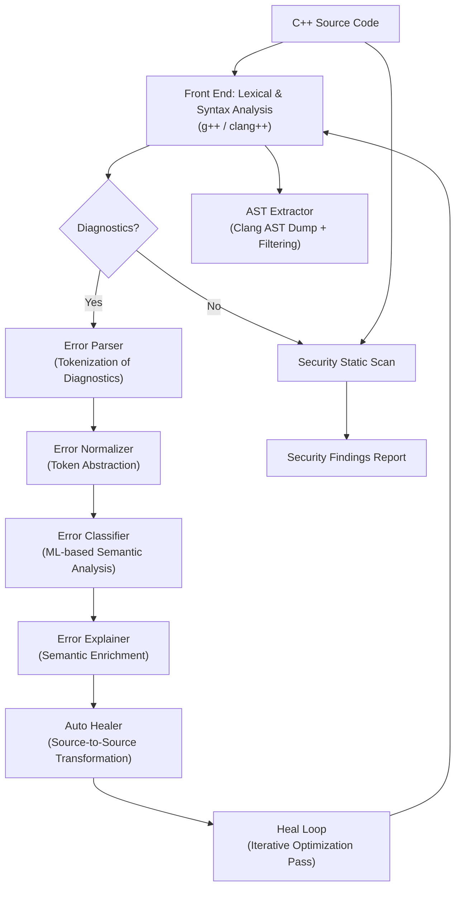
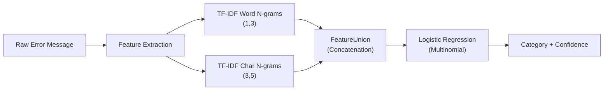
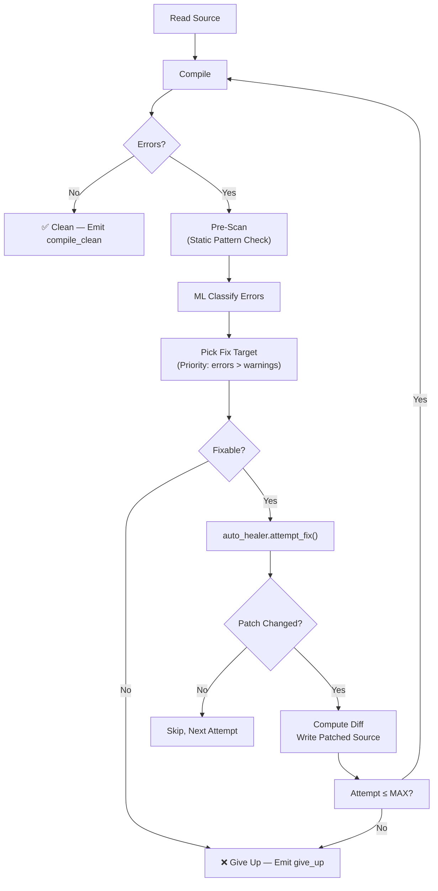
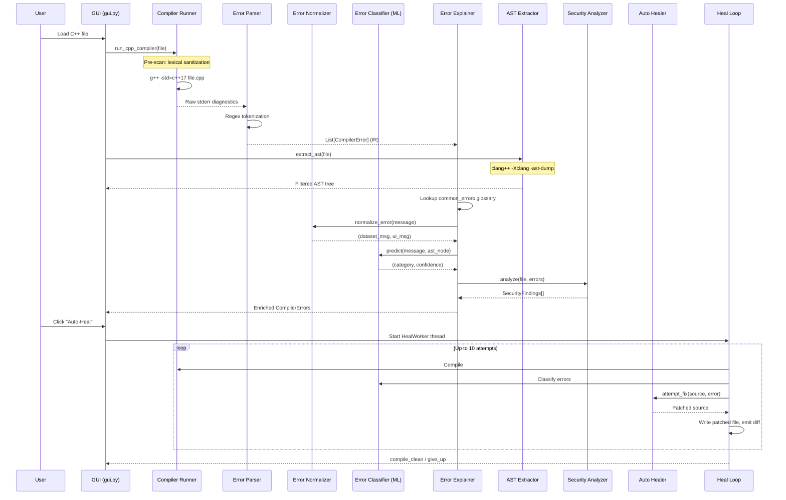

# Green Self-Healing Compiler — Explained via Compiler Design Concepts

## 1. High-Level Architecture

This project implements a **meta-compiler pipeline** — it wraps the standard `g++`/`clang++` toolchain and adds intelligent post-processing phases that mirror the classic compiler pipeline. Instead of generating machine code from source, it processes **compiler diagnostics** through a series of analysis, classification, and transformation passes to automatically explain and repair C++ source code.



---

## 2. Module-by-Module Mapping to Compiler Design Phases

### Phase 1 — Front End (Lexical + Syntax + Semantic Analysis)

#### [compiler_runner.py](file:///Users/chaitanyabhagat/Desktop/Folder/cd1/src/compiler_runner.py) — **The Front End Invocation Layer**

| Compiler Design Concept | Implementation |
|---|---|
| **Lexical Analysis (Scanner)** | Delegates to `g++ -std=c++17`, which performs tokenization internally |
| **Syntax Analysis (Parser)** | Delegates to `g++`, which runs its full parser and emits structured diagnostics |
| **Input Sanitization** | Acts as a **pre-processor guard** — a regex-based scanner (`_sanitize_code()`) that performs lexical screening of the source before it reaches the compiler. Blocks dangerous tokens like `system()`, `__asm__`, `exec()` |

The `_sanitize_code()` function is essentially a **lexical filter** — it pattern-matches raw source text against a set of forbidden token patterns (similar to how a scanner uses regular expressions to identify tokens), rejecting programs before they enter the compilation pipeline.

> [!IMPORTANT]
> This module wraps the actual compiler. It does NOT perform compilation itself — it acts as a **driver** that invokes the external compiler and captures its `stderr` output stream for downstream processing.

---

### Phase 2 — Diagnostic Tokenization

#### [error_parser.py](file:///Users/chaitanyabhagat/Desktop/Folder/cd1/src/error_parser.py) — **Lexical Analysis of Compiler Output**

| Compiler Design Concept | Implementation |
|---|---|
| **Lexical Analysis (Scanner)** | Applies a regex-based scanner to the raw `stderr` stream |
| **Token** | Each parsed error is a structured token: `{file, line, column, type, message}` |
| **Token Classes** | `error`, `warning`, `note`, `linker` — analogous to token categories in a scanner |

The `error_pattern` regex is the **finite automaton** of this phase:
```
^(?P<file>.+?):(?P<line>\d+)(?::(?P<col>\d+))?:\s*(?P<type>error|warning|note):\s*(?P<message>.*)$
```

It decomposes each raw diagnostic line into a structured **token** (a `CompilerError` object). This is exactly how a traditional scanner converts character streams into token streams.

The parser also handles **multi-line diagnostics** (linker errors like `"Undefined symbols for architecture"`) by scanning forward until it finds the terminating pattern — analogous to how a scanner handles multi-line comments or string literals.

#### [models.py](file:///Users/chaitanyabhagat/Desktop/Folder/cd1/src/models.py) — **Intermediate Representation (IR)**

The `CompilerError` class is the project's **Intermediate Representation (IR)**. Just as a compiler builds an IR to pass between phases, this dataclass carries:

| IR Field | Compiler Analogue |
|---|---|
| `file`, `line`, `column` | Source location tracking |
| `error_type` | Token category |
| `message` | Lexeme / raw token value |
| `category` | Semantic label (set by the classifier) |
| `confidence` | Classification probability (akin to parse confidence) |
| `explanation`, `suggestion` | Annotated metadata added during semantic analysis |
| `security_risk`, `risk_reason` | Security attribute decorations |
| `context` | Source code snippet (used for contextual error display) |
| `ast_node` | Nearest AST node type at the error location |

---

### Phase 3 — Token Normalization (Canonicalization)

#### [error_normalizer.py](file:///Users/chaitanyabhagat/Desktop/Folder/cd1/src/error_normalizer.py) — **Token Abstraction & Canonicalization**

| Compiler Design Concept | Implementation |
|---|---|
| **Token Normalization** | Maps raw compiler tokens to abstract semantic labels |
| **Canonical Form** | `';'` → `"statement terminator"`, `'int'` → `"type"`, `'myVar'` → `"identifier"` |
| **Dual Output** | Produces both a **dataset form** (abstract, for ML training) and a **UI form** (concrete, for display) |

This module implements a **token normalization table** — a mapping from surface-level lexical tokens to their abstract semantic equivalents. This is analogous to:
- **Keyword recognition** in a scanner (mapping identifier lexemes to keyword token types)
- **Canonicalization passes** in optimizing compilers (normalizing expressions to a standard form)

The `_TOKEN_MAP` is essentially a **symbol reclassification table**, converting compiler-specific syntax references into language-agnostic semantic labels suitable for ML feature extraction.

---

### Phase 4 — Semantic Analysis (ML Classification)

#### [error_classifier.py](file:///Users/chaitanyabhagat/Desktop/Folder/cd1/src/error_classifier.py) — **Semantic Category Assignment**

| Compiler Design Concept | Implementation |
|---|---|
| **Semantic Analysis** | Assigns meaning (category) to each diagnostic token |
| **Type Checking** | Classifies errors into categories: `syntax_error`, `type_error`, `name_resolution`, `linker_error`, `missing_include`, `redefinition`, `access_error`, `return_type_error`, `unused_variable`, `other` |
| **Symbol Table** | The trained ML model acts as a learned symbol table — it maps error message patterns to semantic categories |

**Architecture of the Classifier (a learned semantic analyzer):**



- **Feature Extraction** uses **TF-IDF vectorization** at both the word and character level — this is analogous to how a compiler's lexer produces tokens at different granularities
- The **FeatureUnion** concatenates word-level and char-level feature vectors — similar to how a parser combines token streams from different sources
- **Logistic Regression with `class_weight='balanced'`** handles training data imbalance — analogous to handling different frequencies of error types in real-world code
- **Hard-coded fast-path rules** (lines 183–204) act as **pattern-matching early exits**, similar to how a parser may short-circuit on well-known patterns before invoking the full grammar

> [!NOTE]
> The classifier uses a **pre-trained serialized model** (`data/error_classifier.joblib`) — a ~37MB file. At runtime, it loads this model (like loading a precompiled grammar) instead of re-training each time. If the serialized model is missing, it trains from `data/training_data.json` (~14MB of labeled examples).

---

### Phase 5 — Semantic Enrichment & Annotation

#### [error_explainer.py](file:///Users/chaitanyabhagat/Desktop/Folder/cd1/src/error_explainer.py) — **Attribute Grammar / Semantic Decoration**

| Compiler Design Concept | Implementation |
|---|---|
| **Attribute Grammar** | Attaches synthesized attributes (`explanation`, `suggestion`, `security_risk`) to each IR node |
| **Semantic Rules** | Template-based rules keyed by category produce structured explanations |
| **Three-Pass Resolution** | 1) Glossary lookup → 2) ML classification → 3) Regex fallback |

This module implements an **attribute grammar** — for each classified error, it synthesizes:
1. **`explanation`** — The "What / Why / How" structured text (synthesized attribute)
2. **`suggestion`** — Actionable fix guidance (synthesized attribute)
3. **`security_risk`** / **`risk_reason`** — Security annotations (inherited attributes from pattern matching)

The three-pass resolution strategy mirrors how compilers resolve attributes:
1. **Glossary lookup** ([common_errors.py](file:///Users/chaitanyabhagat/Desktop/Folder/cd1/src/common_errors.py)) — a curated **lookup table** of known error patterns with pre-written explanations. Analogous to a **hardcoded semantic rule**.
2. **ML classification** — when the glossary misses, the learned classifier provides a category, and a template generates the explanation. Analogous to a **grammar-driven semantic action**.
3. **Regex fallback** — when ML confidence is below 0.45, regex patterns catch well-known messages. Analogous to **error recovery rules** in a parser.

#### [common_errors.py](file:///Users/chaitanyabhagat/Desktop/Folder/cd1/src/common_errors.py) — **Error Production Rules / Glossary**

This file is a **production rule table** — a curated set of 24 known error patterns with pre-written semantic attributes. Each entry maps a specific diagnostic message to a fixed `category`, `explanation`, `suggestion`, `ast_node`, and `confidence`. It acts as the project's **deterministic grammar** for common errors before the ML model (the probabilistic grammar) is consulted.

---

### Phase 6 — Abstract Syntax Tree (AST) Extraction

#### [ast_extractor.py](file:///Users/chaitanyabhagat/Desktop/Folder/cd1/src/ast_extractor.py) — **AST Construction & Filtering**

| Compiler Design Concept | Implementation |
|---|---|
| **AST Dump** | Uses `clang++ -Xclang -ast-dump -fsyntax-only` to get the full AST |
| **AST Filtering** | Streams the output and filters subtrees to the user's source file only |
| **Tree Construction** | `parse_ast_to_tree()` builds a nested dictionary tree from the indented AST dump |
| **AST Node Lookup** | `extract_node_near_line()` finds the nearest visible AST node at a given line |

The filtering logic is a **tree pruning pass** — it tracks whether the current subtree belongs to the user file or to an included system header, and discards external subtrees. This is analogous to how a compiler's front end filters or prunes AST nodes that belong to included headers during code generation.

**Key design decisions:**
- **`VISIBLE_NODES`** (65 node types) acts as a **whitelist grammar** — only these AST node types pass through to the GUI tree viewer
- **`MAX_TREE_DEPTH = 9`** bounds the tree depth — analogous to depth-limited parsing
- **`ADDRESS_RE`** strips pointer addresses from the AST dump — a **normalization pass** on the tree representation

---

### Phase 7 — Source-to-Source Transformation (Code Generation / Patching)

#### [auto_healer.py](file:///Users/chaitanyabhagat/Desktop/Folder/cd1/src/auto_healer.py) — **Source-to-Source Compiler (Transformations)**

| Compiler Design Concept | Implementation |
|---|---|
| **Code Generation** | Instead of generating target code from IR, it generates **patched source code** from the error + original source |
| **Peephole Optimization** | Each `fix_*` function is a localized, pattern-matching transformation rule |
| **Pattern-Directed Rewriting** | Uses regex on source lines to match and rewrite specific code patterns |

This is the heart of the "self-healing" mechanism. Each fix function is a **source-to-source transformation rule**:

| Fix Function | Transformation Rule |
|---|---|
| `fix_syntax_error()` | Missing `;` → append semicolon; `=` → `==` in conditions |
| `fix_missing_include()` | Missing symbol → insert `#include` directive |
| `fix_name_resolution()` | Bare `cout` → `std::cout`; or insert `using namespace std;` |
| `fix_undeclared_variable()` | Undeclared `x = 5;` → `auto x = 5;` |
| `fix_uninitialized_variable()` | `int x;` → `auto x = 0;` (type-appropriate initialization) |
| `fix_integer_overflow()` | `int` → `long long` widening |
| `inject_division_guard()` | `/0` → guard with `if (divisor == 0)` check |
| `fix_missing_closing_braces()` | Tracks brace depth in a **stack-based parser** and appends missing `}` at EOF |
| `fix_stream_operator()` | `cin <<` → `cin >>`, `cout >>` → `cout <<` |

> [!TIP]
> The `fix_missing_closing_braces()` function is essentially a **mini-parser** — it maintains a brace stack, handles string literals, block comments, and raw strings, and determines where to insert closing braces. This mirrors how a real parser tracks scope depth.

The `_fix_keyword_typo()` function implements a **spell-checker for C++ keywords** using:
1. A **transposition variant map** (pre-computed adjacent swaps)
2. **Bounded Levenshtein distance** (edit distance ≤ 2)

This is analogous to **error recovery in parsers** where the parser tries to suggest corrections for misspelled keywords.

---

### Phase 8 — Iterative Optimization (Heal Loop)

#### [heal_loop.py](file:///Users/chaitanyabhagat/Desktop/Folder/cd1/src/heal_loop.py) — **Multi-Pass Optimization Loop**

| Compiler Design Concept | Implementation |
|---|---|
| **Multi-pass optimization** | Up to `MAX_ATTEMPTS = 10` iterations of compile → classify → patch → recompile |
| **Fixed-point iteration** | Loop terminates when: compilation succeeds (fixpoint reached), same error seen twice (no progress), or attempt limit hit |
| **Worklist algorithm** | Errors are prioritized: real errors before warnings; unfixable categories are skipped |



The `_pre_scan()` function is a **static analysis pre-pass** — it detects issues like division-by-zero, integer overflow, and assignment-in-condition before the compiler's own diagnostics. This is analogous to **dataflow analysis** or **constant propagation** in an optimizing compiler.

The **seen_errors set** prevents infinite loops by detecting when the same error reappears — this is the project's **convergence check** for the fixed-point iteration.

#### [healing_suggester.py](file:///Users/chaitanyabhagat/Desktop/Folder/cd1/src/healing_suggester.py) — **Error Recovery & User Interaction**

When auto-healing fails, this module generates structured suggestions. It is the project's **error recovery module** — analogous to panic-mode or phrase-level error recovery in a parser. It provides two types of output:

1. **`_format_error()`** — A concrete fix suggestion (analogous to a parser auto-correcting and continuing)
2. **`_format_ask()`** — A request for user input (analogous to a parser asking for clarification when recovery is ambiguous)

The `_nearest_keyword()` function uses bounded Levenshtein distance to suggest corrections for misspelled tokens — a classic **spell-checking** technique also used in compiler diagnostics.

---

### Phase 9 — Static Security Analysis

#### [security_analyzer.py](file:///Users/chaitanyabhagat/Desktop/Folder/cd1/src/security_analyzer.py) — **Extended Semantic Analysis (Security Pass)**

| Compiler Design Concept | Implementation |
|---|---|
| **Static Analysis** | Pattern-based scanning of source code for security vulnerabilities |
| **Attribute Decoration** | Attaches `SecurityFinding` annotations to specific source locations |
| **Scope Analysis** | Tracks brace-delimited scope for malloc/free leak detection |

This module implements two analysis strategies:

**1. Compiler Diagnostic Rules** (`_DIAGNOSTIC_RULES`) — Pattern-match on compiler warning/error messages to elevate them to security findings. These are **semantic rules** that re-interpret compiler diagnostics through a security lens.

**2. Source-Level Static Scan** (`_scan_source_findings()`) — A full-file scanner that:

| Analysis | Compiler Design Analogue |
|---|---|
| `gets()` / `strcpy()` detection | **Pattern-matching** on known dangerous tokens |
| `scanf("%s")` format string parsing | **Lexical analysis** of format string sub-language |
| Scope tracking for malloc/free | **Scope analysis** using a brace-depth stack (like a symbol table's scope chain) |
| `delete` → use-after-free tracking | **Dataflow analysis** — tracking pointer liveness |
| Double free detection | **Reaching definitions** — tracking which `delete` reaches which use |
| Block comment / string literal stripping | **Lexer state machine** — `_strip_code()` implements a full finite automaton with states for block comments, raw strings, and quoted literals |

> [!NOTE]
> The `_strip_code()` function is a **complete lexer** — it handles C++ comments (`//`, `/* */`), raw string literals (`R"delimiter(...)"delimiter"`), and quoted strings with escape sequences. It strips these from the code line so the security scanner only sees executable code.

---

## 3. The Full Pipeline — End to End

Here is the complete data flow when a C++ file is analyzed:



---

## 4. Summary Table — Compiler Design Term → Project Module

| Compiler Design Concept | Project Module | File |
|---|---|---|
| **Lexer / Scanner** | Input sanitization; error line tokenizer | `compiler_runner.py`, `error_parser.py` |
| **Parser** | GCC/Clang invocation; brace-depth tracking | `compiler_runner.py`, `auto_healer.py` |
| **Intermediate Representation (IR)** | `CompilerError` dataclass | `models.py` |
| **Token Normalization** | Abstract semantic labels for ML | `error_normalizer.py` |
| **Semantic Analysis** | ML error classification | `error_classifier.py` |
| **Attribute Grammar** | Explanation + suggestion enrichment | `error_explainer.py` |
| **Error Production Rules** | Common errors glossary | `common_errors.py` |
| **AST Construction** | Clang AST dump + filtering + tree building | `ast_extractor.py` |
| **Source-to-Source Transformation** | Pattern-directed code rewriting | `auto_healer.py` |
| **Multi-Pass Optimization** | Iterative heal loop with convergence check | `heal_loop.py` |
| **Error Recovery** | Failure suggestions and user queries | `healing_suggester.py` |
| **Static Analysis** | Security vulnerability scanning | `security_analyzer.py` |
| **Dataflow Analysis** | malloc/free tracking, use-after-free detection | `security_analyzer.py` |
| **Symbol Table** | Trained ML model + symbol→header map | `error_classifier.py`, `auto_healer.py` |
| **Code Generation** | Patched source output | `auto_healer.py` |
| **Pre-Processor** | Security input filter (before compilation) | `compiler_runner.py` |
| **Scope Analysis** | Brace stack for leak detection | `security_analyzer.py` |
| **Spell-Checking / Error Correction** | Levenshtein distance for keyword typos | `auto_healer.py`, `healing_suggester.py` |
| **Energy Profiling** | CodeCarbon telemetry per compilation pass | `heal_loop.py` |
